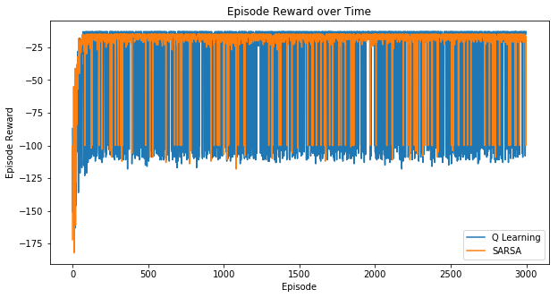

cliffwalker
=======
[](LICENSE.md)

UNDER CONSTRUCTION

Cliffwalker is implementation of Q Learning and Expected Value SARSA agents on variations of the Gridworld Cliff reinforcement learning task as in example 6.6 in *Reinforcement Learning: An Introduction* [[1]](#references)

- [x] Q Learning
- [x] Expected Value SARSA
- [x] Gridworld Cliff
- [ ] Variations of Gridworld Cliff

Cliffwalking
------------
Example 6.6 in *Reinforcement Learning: An Introduction*
```
o  o  o  o  o  o  o  o  o  o  o  o
o  o  o  o  o  o  o  o  o  o  o  o
o  o  o  o  o  o  o  o  o  o  o  o
x  C  C  C  C  C  C  C  C  C  C  T
```

SARSA policy
```
>  >  >  >  >  >  >  >  >  >  >  v
>  >  >  >  >  >  >  >  >  >  >  v
^  ^  ^  ^  ^  ^  ^  ^  ^  >  >  v
X  C  C  C  C  C  C  C  C  C  C  T
```

Q Learning policy
```
^  ^  >  >  >  v  >  >  >  >  >  v
>  >  >  >  >  >  >  >  >  >  >  v
>  >  >  >  >  >  >  >  >  >  >  v
X  C  C  C  C  C  C  C  C  C  C  T
```


Requirements
------------

- [Gym](https://gym.openai.com/)

Acknowledgements
----------------

- [@dennybritz](https://github.com/dennybritz) for [Cliffwalking](https://github.com/dennybritz/reinforcement-learning/blob/master/lib/envs/cliff_walking.py)

References
----------


[1] [Reinforcement Learning: An Introduction](http://www.incompleteideas.net/sutton/book/ebook/the-book.html)